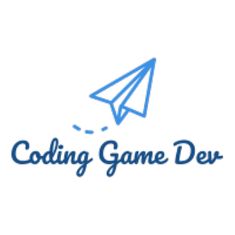

<link rel="preconnect" href="https://fonts.gstatic.com">
<link href="https://fonts.googleapis.com/css2?family=Potta+One&display=swap" rel="stylesheet">

<!-- PROJECT LOGO -->
<br />
<p align="center">
  <a href="https://github.com/josephAttia/coding-game-dev">
    
  </a>

  <h3 align="center">Coding Game Dev</h3>

  <p align="center">
    Have you ever wanted to code a game? Ok....maybe you have but how many REAL tutorials are there? Well Coding Game Dev has interactive tutorials that teach you everything so you could go from zero to HERO in game dev! 
    <br />
    <a href="https://github.com/josephAttia/coding-game-dev"><strong>Explore the docs »</strong></a>
    <br />
    <br />
    <a href="https://github.com/josephAttia/coding-game-dev">View Demo</a>
    ·
    <a href="https://github.com/josephAttia/coding-game-dev/issues">Report Bug</a>
    ·
    <a href="https://github.com/josephAttia/coding-game-devissues">Request Feature</a>
  </p>
</p>

  <h1 align="center" >Login</h1>
  <p align="center">
    
  </p>
  <h1 align="center">Signup</h1>
  <p align="center">
  
  </p>
  


<!-- TABLE OF CONTENTS -->
  <summary><h2 style="display: inline-block">Table of Contents</h2></summary>
  <details open="open">
  <ol>
    <li>
      <a href="#about-the-project">About The Project</a>
      <ul>
        <li><a href="#built-with">Built With</a></li>
      </ul>
    </li>
    <li>
      <a href="#getting-started">Getting Started</a>
      <ul>
        <li><a href="#prerequisites">Prerequisites</a></li>
        <li><a href="#installation">Installation</a></li>
      </ul>
    </li>
    <li><a href="#usage">Usage</a></li>
    <li><a href="#roadmap">Roadmap</a></li>
    <li><a href="#contributing">Contributing</a></li>
    <li><a href="#license">License</a></li>
    <li><a href="#contact">Contact</a></li>
    <li><a href="#acknowledgements">Acknowledgements</a></li>
  </ol>
</details>


<!-- ABOUT THE PROJECT -->
## About The Project
Have you ever wanted to code a game? Ok....maybe you have but how many REAL tutorials are there? Well Coding Game Dev has interactive tutorials that teach you everything so you could go from zero to HERO in game dev! 

### Built With

* []()Flask
* []()HTML
* []()CSS
* []()Firebase


<!-- GETTING STARTED -->
## Getting Started

To get a local copy up and running follow these simple steps.

### Prerequisites

* python
  ```python
  pip install -r requirements.txt
  ```

### Installation

1. Clone the repo
   ```sh
   git clone https://github.com/josephAttia/coding-game-dev.git
   ```
2. Install Python Libraries
   ```python
    pip install -r requirements.txt
  ```
